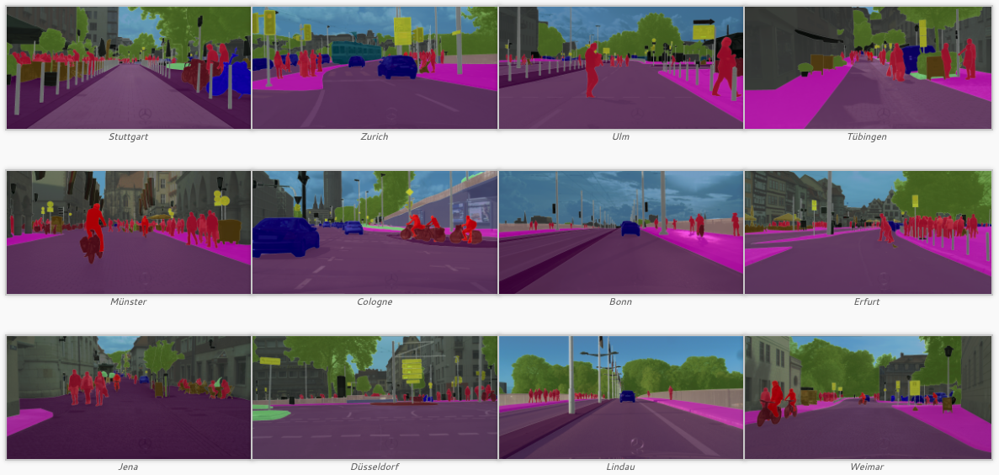

# Awesome Road Environment Segmentation

Captured from Cityscapes (https://www.cityscapes-dataset.com/examples/)

## Networks by architecture

#### DeepLabv3+ [*paper*](https://arxiv.org/abs/1802.02611)

- *[Tensorflow]* https://github.com/tensorflow/models/tree/master/research/deeplab
- *[Tensorflow]* https://github.com/tantara/JejuNet
- *[Keras]* https://github.com/bonlime/keras-deeplab-v3-plus
- *[PyTorch]* https://github.com/jfzhang95/pytorch-deeplab-xception
- *[PyTorch]* https://github.com/y-ouali/pytorch_segmentation
- [*more...*](https://paperswithcode.com/paper/encoder-decoder-with-atrous-separable#code)

 

#### HRNetV2 [*paper*](https://arxiv.org/abs/1909.11065)

- *[PyTorch]* https://github.com/openseg-group/openseg.pytorch
- *[PyTorch]* https://github.com/PkuRainBow/OCNet.pytorch
- *[PyTorch]* https://github.com/HRNet/HRNet-Semantic-Segmentation
- [*more...*](https://paperswithcode.com/paper/object-contextual-representations-for#code)

 

##  Datasets

| Name                                                         | Categories                      | Volume                      | Link                                                         |
| ------------------------------------------------------------ | ------------------------------- | --------------------------- | ------------------------------------------------------------ |
| [**Cityscapes**](https://www.cityscapes-dataset.com/)        | road, sidewalk, guard rail, ... | 30 classes / 25,000 images  | [*Features*](https://www.cityscapes-dataset.com/dataset-overview/#features) |
| [**Mapillary (Vistas)**](https://www.mapillary.com/dataset/vistas) | road, curb, barrier, wall, ...  | 152 classes / 25,000 images | [*Features*](https://www.mapillary.com/dataset/vistas)       |
| [**A2D2**](https://www.audi-electronics-venture.de/aev/web/en/driving-dataset.html) | road, sidebars, curbstone, ...  | 38 classes / 41,280 images  | [*Features*](https://www.audi-electronics-venture.de/aev/web/en/driving-dataset/dataset.html) |
| [**ApolloScape (Scene Parsing)**](http://apolloscape.auto/scene.html) | road, sidewalk, fence, ...      | 37 classes / 74,555 images  | [*Features*](http://apolloscape.auto/scene.html)             |
| [**DeepDrive**](https://bdd-data.berkeley.edu/)              | road, sidewalk, guard rail, ... | 40 classes / 10,000 images  | [*Features*](https://bdd-data.berkeley.edu/)                 |
| [**KITTI**](http://www.cvlibs.net/datasets/kitti/)           | road, sidewalk, guard rail, ... | 34 classes / 400 images     | [*Features*](http://www.cvlibs.net/datasets/kitti/eval_semseg.php?benchmark=semantics2015) |

** A2D2: AEV(Audi Electronics Venture) Autonomous Driving Dataset

## Annotation tools

## Getting Started Guide

- https://towardsdatascience.com/a-keras-pipeline-for-image-segmentation-part-1-6515a421157d
- https://github.com/mrgloom/keras-semantic-segmentation-example

## Benchmarks

- Papers with code: https://paperswithcode.com/task/semantic-segmentation
- Cityscapes: https://www.cityscapes-dataset.com/benchmarks/#scene-labeling-task
- KITTI: http://www.cvlibs.net/datasets/kitti/eval_semseg.php?benchmark=semantics2015
- WildDash: http://www.wilddash.cc/benchmark/summary_tbl?hc=semantic_rob
- Robust Vision Challenge: http://www.robustvision.net/leaderboard.php?benchmark=semantic
- MIT Scene Parsing Benchmark: http://sceneparsing.csail.mit.edu/

## Evaluation of benchmarks

- Cityscapes: https://github.com/mcordts/cityscapesScripts
- Mapillary: https://github.com/mapillary/mapillary_vistas
- DeepDrive: https://github.com/ucbdrive/bdd-data/blob/master/bdd_data/evaluate.py
- MIT: https://github.com/CSAILVision/sceneparsing/tree/master/evaluationCode

## Papers, blog posts and others

#### Papers

- [***DeepLabv1***, 2015] [Semantic Image Segmentation with Deep Convolutional Nets and Fully Connected CRFs](https://arxiv.org/abs/1412.7062)
- [***DeepLabv2***, 2017] [DeepLab : Semantic Image Segmentation with Deep Convolutional Nets, Atrous Convolution, and Fully Connected CRFs](https://arxiv.org/abs/1606.00915)
- [***DeepLabv3***, 2017] [Rethinking Atrous Convolution for Semantic Image Segmentation](https://arxiv.org/abs/1706.05587)
- [***DeepLabv3+***, 2018] [Encoder-Decoder with Atrous Separable Convolution for Semantic Image Segmentation](https://arxiv.org/abs/1802.02611)
- [***HRNetV2***, 2019] [Object-Contextual Representations for Semantic Segmentation](https://arxiv.org/abs/1909.11065)

####Blog posts

- https://blog.lunit.io/2018/07/02/deeplab-v3-encoder-decoder-with-atrous-separable-convolution-for-semantic-image-segmentation/
- https://towardsdatascience.com/deeplabv3-c5c749322ffa

####Awesome series

- https://github.com/mrgloom/awesome-semantic-segmentation
- https://github.com/nightrome/really-awesome-semantic-segmentation
- https://github.com/Tramac/awesome-semantic-segmentation-pytorch

####Reference repositories

- https://github.com/GeorgeSeif/Semantic-Segmentation-Suite
- https://github.com/MSiam/TFSegmentation
- https://github.com/qubvel/segmentation_models
- https://github.com/divamgupta/image-segmentation-keras

####Others

- [Deep Multi-modal Object Detection and Semantic Segmentation for Autonomous Driving: Datasets, Methods, and Challenges](https://boschresearch.github.io/multimodalperception/index.html)

